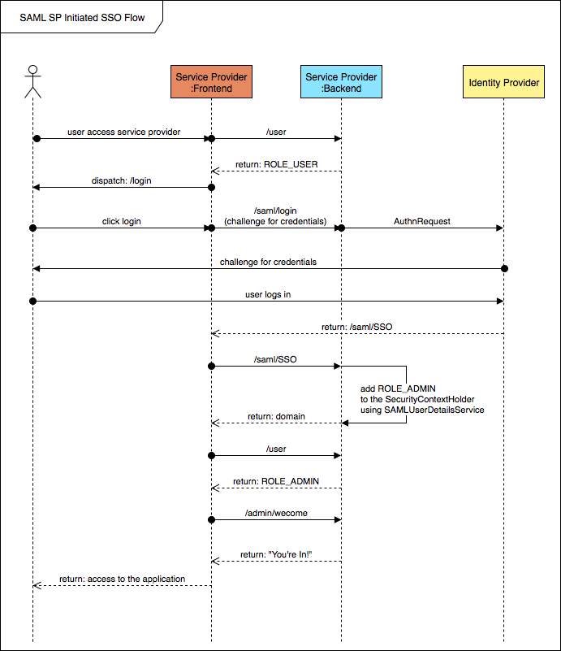

SAML 2.0 Service Provider Example
====================

---------

## References

#### [Spring Boot](http://projects.spring.io/spring-boot/)

> Spring Boot makes it easy to create stand-alone, production-grade Spring based Applications that you can "just run".
> We take an opinionated view of the Spring platform and third-party libraries so you can get started with minimum fuss. Most Spring Boot applications need very little Spring configuration.

#### [Spring Security SAML Extension](http://projects.spring.io/spring-security-saml/)

> Spring Security SAML Extension allows seamless combination of SAML 2.0 and authentication and federation mechanisms in a single application. All products supporting SAML 2.0 in Identity Provider mode (e.g. ADFS, Okta, Shibboleth, OpenAM, Efecte EIM or Ping Federate) can be used to connect with the extension.

#### [Angular](https://angular.io)

> Angular is a platform that makes it easy to build applications with the web. Angular combines declarative templates, dependency injection, end to end tooling, and integrated best practices to solve development challenges. Angular empowers developers to build applications that live on the web, mobile, or the desktop

---------

## Project description

This project is a simple **SAML 2.0 Service Provider**, built using **Angular 5** and the **Spring Framework**. It was made to demonstrate how an enterprise application might implement single sign-on using SAML. The Spring security configuration was written using Java annotations with no XML is used (thanks to Vincenzo De Notaris mentioned below).

The Angular part of the project runs on port 8080 and the Sprint Boot part runs on port 8094. The Angular portion must run on 8080 as the service provider URL was configured with the identity provider to use localhost:8080.

**[SSOCircle](http://www.ssocircle.com/en/portfolio/publicidp/)** is used as a public Identity Provider for testing purposes. You must make an account to use this application.

Thanks to *Vincenzo De Notaris* for his project: [spring-boot-security-saml-sample](https://github.com/vdenotaris/spring-boot-security-saml-sample).

---------

The lifecycle of the sample application is represented below. If only sequence diagrams looked prettier.

---------

### License

    Copyright 2018 Isaac Garza

	Licensed under the Apache License, Version 2.0 (the "License");
	you may not use this file except in compliance with the License.
	You may obtain a copy of the License at

	    http://www.apache.org/licenses/LICENSE-2.0

	Unless required by applicable law or agreed to in writing, software
	distributed under the License is distributed on an "AS IS" BASIS,
	WITHOUT WARRANTIES OR CONDITIONS OF ANY KIND, either express or implied.
	See the License for the specific language governing permissions and
	limitations under the License.

